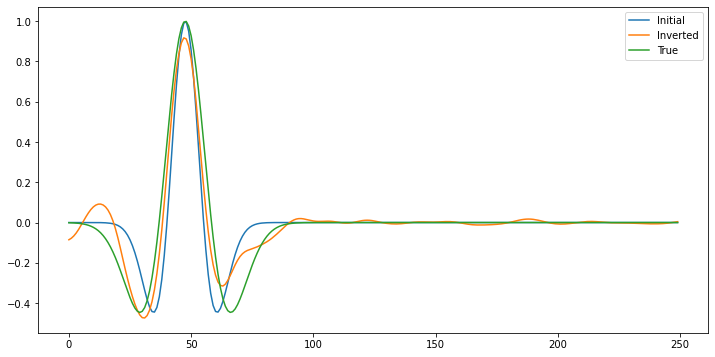

# FWIGAN: Full-Waveform Inversion with Deep Adversarial Network

This repo contains a PyTorch implementation with [DeepWave](https://github.com/ar4/deepwave) for the FWIGAN based on the following papers:

1. [Revisit Geophysical Imaging in A New View of Physics-informed Generative Adversarial Learning](https://arxiv.org/abs/2109.11452)
2. [CryoGAN: A New Reconstruction Paradigm for Single-Particle Cryo-EM Via Deep Adversarial Learning](https://ieeexplore.ieee.org/document/9483649)

I implemented the FWIGAN to invert the velocity model, source wavelet, and noise level in data based on the additive Gaussian noise. Kindly check the Jupyter Notebooks for further details.

